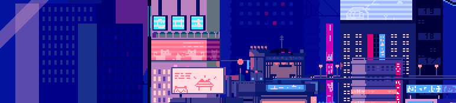

  

    
  

  <h1>Gabriela Schaper</h1>

---

👋 Olá, me chamo Gabriela Schaper

🎓 Cursando Ciência da Computação na PUC Minas

📚 Formação Técnica em Informática (Cotemig)

💡 Tenho interesse em desenvolvimento de software e busco constantemente aprofundar meus conhecimentos em diferentes linguagens e tecnologias.

🚀 Procuro oportunidades para aplicar meus conhecimentos em projetos reais e crescer profissionalmente na área de tecnologia.

📧 Redes / Contato:

 

---

## 🛠 Tech Stack

💻 **Desktop:**  

📱 **Mobile:**  
 

🌐 **Web:**  
 
  

🗄️ **Banco de Dados:**  

🎨 **Design:** 

---

# 📊 GitHub Stats

  

